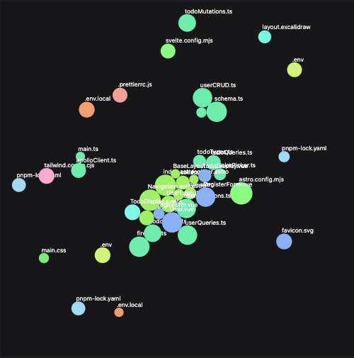

<p align="center">
  
 </p>

 <p align="center">
  <a href="https://marketplace.visualstudio.com/items?itemName=codegraphy.codegraphy"></a>
  <a href="https://marketplace.visualstudio.com/items?itemName=codegraphy.codegraphy"></a>
  <a href="https://marketplace.visualstudio.com/items?itemName=codegraphy.codegraphy"></a>
</p>

# CodeGraphy

> CodeGraphy **enhances** files connections inside VSCode and allows for **birds eye views** of each repository. It helps you to **visualize code hierarchy** at a glance, **seamlessly navigate and explore** your file hierarchy, **gain valuable insights** via a force based node graph UI, and more.

CodeGraphy is an [open-source](https://github.com/joesobo/CodeGraphyV2 'Open CodeGraphyV2 on GitHub') extension for [Visual Studio Code](https://code.visualstudio.com).

Simply CodeGraphy helps you **better understand file connections**. With its force-based graph you can get a completely different view of the architecture of your codebase and make quick informed decisions about where your code is "knotted" in the graph.

## Install CodeGraphyV2

Install old CodeGraphy for [VSCode](https://marketplace.visualstudio.com/items?itemName=codegraphy.codegraphy)

CodeGraphyV2 is coming soon...

## Features



- D3 physics based graph
- Color coding nodes
- Multiple color palette options
- Customizable overrides
- File blacklist
- and more!

## Upcoming in V2

- [ ] Collapsible nodes
- [ ] Displays connections to external packages
- [x] Ability to switch between files through graph nodes
- [x] Switch between different connection display (interactions vs classic directory)
- [x] Switch between different level of view (entire graph vs local graph)
- [x] Switch between different node size factors (connections vs lines)
- [x] Switch between different base color palette (d3 vs random)
- [x] Variety of d3 base palettes
- [x] Variety of d3 force sliders to change graph physics
- [x] Variety of options to hide / display different features within the graph
- [x] Analyzed table view of directory contents
- [x] Entirely built on Vite & D3 so its much faster

### Node Graph

CodeGraphy's main feature is its ability to display the file hierarchy in a completely different way. Look within the current directory and the connections between the files of the directory.

- Ability to open files directly from nodes (Coming Soon)
- Can change the style of the force-based graph
- Displays connections between files


### Settings

You can also `blacklist` any files or folders you want ignored. Add this configuration to your vscode `settings.json`

```json
"codegraphy.blacklist": [
    ".spec.",
    ".vscode",
    ".git",
    ".github",
    "node_modules",
    "dist",
	...
],
```


## Known Issues

- This extension is currently being developed for the JS programming language, hopefully more support will come soon.
- This extension does not support custom import paths ex: `import x from '@/src/components'`

## Contributing

Contributions are always welcome for CodeGraphy! Please make sure to read the [Contributing Guide](https://github.com/joesobo/CodeGraphy/blob/main/.github/CONTRIBUTING.md) before making a pull request.

## License

[MIT](https://opensource.org/licenses/MIT)

Copyright (c) 2022-present, Joe Soboleski
