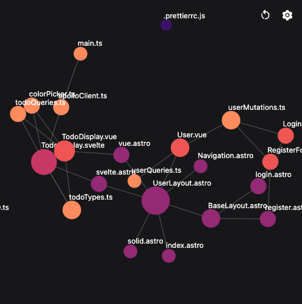
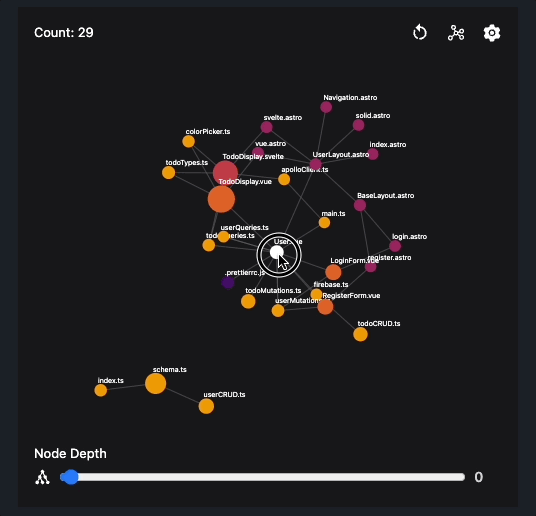
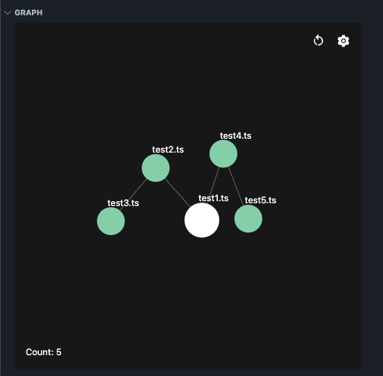
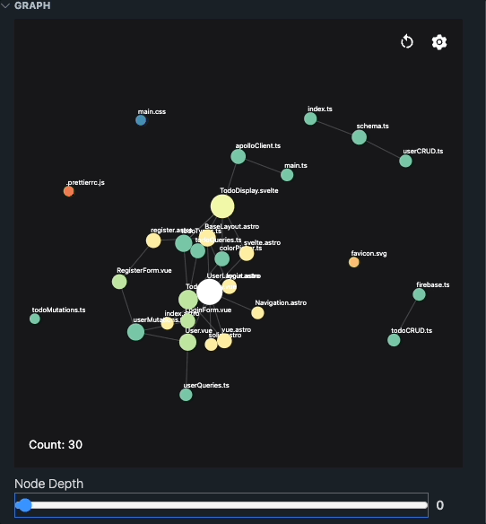

<p align="center">
  <svg xmlns="http://www.w3.org/2000/svg" width="512" height="512" viewBox="0 0 256 256"><path fill="#fff" d="M200 152a31.84 31.84 0 0 0-19.53 6.68l-23.11-18A31.65 31.65 0 0 0 160 128c0-.74 0-1.48-.08-2.21l13.23-4.41A32 32 0 1 0 168 104c0 .74 0 1.48.08 2.21l-13.23 4.41A32 32 0 0 0 128 96a32.59 32.59 0 0 0-5.27.44L115.89 81A32 32 0 1 0 96 88a32.59 32.59 0 0 0 5.27-.44l6.84 15.4a31.92 31.92 0 0 0-8.57 39.64l-25.71 22.84a32.06 32.06 0 1 0 10.63 12l25.71-22.84a31.91 31.91 0 0 0 37.36-1.24l23.11 18A31.65 31.65 0 0 0 168 184a32 32 0 1 0 32-32Zm0-64a16 16 0 1 1-16 16a16 16 0 0 1 16-16ZM80 56a16 16 0 1 1 16 16a16 16 0 0 1-16-16ZM56 208a16 16 0 1 1 16-16a16 16 0 0 1-16 16Zm56-80a16 16 0 1 1 16 16a16 16 0 0 1-16-16Zm88 72a16 16 0 1 1 16-16a16 16 0 0 1-16 16Z"/></svg>
 </p>

 <p align="center">
  <a href="https://marketplace.visualstudio.com/items?itemName=codegraphy.codegraphy"></a>
  <a href="https://marketplace.visualstudio.com/items?itemName=codegraphy.codegraphy"></a>
  <a href="https://marketplace.visualstudio.com/items?itemName=codegraphy.codegraphy"></a>
</p>

# CodeGraphy

> CodeGraphy **enhances** files connections inside VSCode and allows for **birds eye views** of each repository. It helps you to **visualize code hierarchy** at a glance, **seamlessly navigate and explore** your files, **gain valuable insights** via a force based node graph, and more!

CodeGraphy is an [open-source](https://github.com/joesobo/CodeGraphyV2 'Open CodeGraphyV2 on GitHub') extension for [Visual Studio Code](https://code.visualstudio.com).

Simply this extension helps you **better understand file connections**. With its force-based graph you can get a completely different perspective of the architecture of your codebase and make quick informed decisions about the entire repository.

## Install CodeGraphyV2

Install old CodeGraphy for [VSCode](https://marketplace.visualstudio.com/items?itemName=codegraphy.codegraphy)

CodeGraphyV2 is coming soon...

## Features



- D3 physics based graph
- Color coding nodes
- Multiple color palette options
- Customizable overrides
- File blacklist
- and more!

## Upcoming in V2



- [x] Collapsible nodes
- [x] Displays connections to external packages (node_modules)
- [x] Switch between files through graph nodes
- [x] Switch between different connection display modes (Interactions vs classic Directory)
- [x] Slide to meet your desired node depth to display
- [x] Switch between different node size factors (Connections vs Line count)
- [x] Switch between different base color palette (D3 vs Random)
- [x] Variety of D3 base palettes
- [x] Variety of D3 force sliders to change graph physics
- [x] Variety of options to hide / display different features within the graph
- [x] Analyzed table view of directory contents with color overrides
- [x] Entirely built on Vite & D3



### Node Graph

CodeGraphy's main feature is its ability to display the file hierarchy in a completely new perspective. Look within your current directory and visualize the connections between your files. Many of the commonly used features in a normal file hierarchy apply here too!

- Ability to open files directly from nodes
- See the what classic directory mode looks like when graphed



### Settings

You can customize the `blacklist` of any files or folders you want ignored. Add this configuration to your vscode `settings.json`

```json
"codegraphy.blacklist": [
    ".spec.",
    ".vscode",
    ".git",
    ".github",
    "node_modules",
    "dist",
	...
],
```

All the customizable settings in Codegraphy can also be added into your workspace `settings.json` to save state in-between sessions.

**Nodes**
- connectionType: "Interaction" | "Directory"
- nodeSize: "Lines" | "Connections"
- showNodeModules: boolean
- showOrphans: boolean
- showLabels: boolean
- showOutlines: boolean
- doCollisions: boolean

**D3 Forces**
- centerForce: number
- chargeForce: number
- linkForce: number
- linkDistance: number

**Colors**
- nodeColor: "D3" | "Random"
- selectedD3Color: string

## Known Issues

- This extension is currently being developed for the JS programming language, hopefully more support will come soon.
- This extension does not support custom import paths ex: `import x from '@/src/components'`

## Contributing

Contributions are always welcome for CodeGraphy! Please make sure to read the [Contributing Guide](https://github.com/joesobo/CodeGraphy/blob/main/.github/CONTRIBUTING.md) before making a pull request.

## License

[MIT](https://opensource.org/licenses/MIT)

Copyright (c) 2022-present, Joe Soboleski
